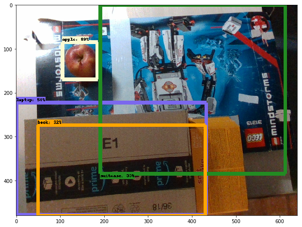
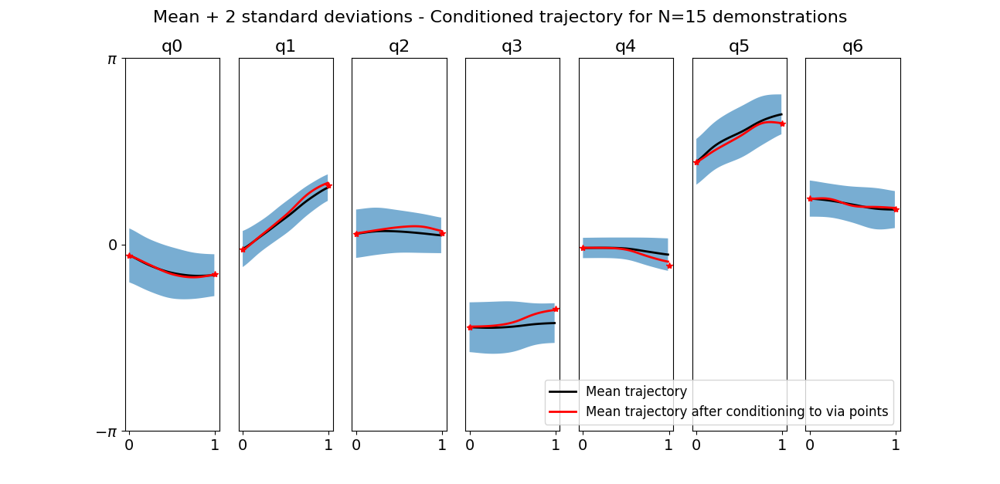

# We taught a robot how to eat apples.

Ok, we did not, it does not chew nor digest the apple.  But we taught it how to see one, reach for it and aovid obstacles in between.  Does that sound cool? Certainly. But, how did we do it?  How could it be useful? Well, stay with us to the end... 

## How we did it

Over the last couple of weeks our team, *the* [*Deterministically Suboptimal*] *Cheesecake*, had the chance to work with a Franka Emika Panda robotic arm. The general goal was to come up with a framework which would  allow the robotic arm to identify objects and other agents, distinguish them from background and itself as well as avoid obstacles during movement. Additionally we could implement a *brownie task* which would make use of the other features while performing an action such as cleaning up a table or handing objects to another agent. 

After some experimenting we settled for a an apple-centered approach: we would make the robot look for an apple, reach for it, pick it up and release it. All of this while constantly trying to not crash into any of the surrounding obstacles. We then further divided this main task into three subcomponents: object identification (*Seeing*), obstacle avoidance (*Sensing*) and movement (*Reaching*) .  

#### Module 1  - Seeing

To be able to interact with the world the robot must have some sense of what this world consists of. This means it has to be able to identify and locate objects. For this part of the task we could make use of the pandas rgb-d camera, but even with color and depth information image segmentation and object identification still poses a huge technical challenge. Our first step was to reduce and simplify. Our prior goal was to know the locations of an apple in a frame taken by the camera.

We decided not to train an object detection network from scratch, but instead make use of existing models, mainly the models from TensorFlow API model zoo. We chose a model trained on the CoCo dataset, which contains images from 90 common objects such as apples, people, tables, laptops, etc. This dataset is commonly used to train networoks for segmentation, detection and captioning tasks.  Next to labels for images, it also provides annotations and masks for the location of objects as coordinates in image frames. So sequentially the networks trained on this dataset will learn bounding boxes around the objects of interest.

We decided to use the Faster-RCNN model  from Tensorflow API, which was first introduced by Ren et. al. in [1]. This network uses VGG19 architecture and wins in accuracy because region proposals are offered frst and classification is only performed on the proposed regions. Also the classification is pretty fast:  for one frame to be classified, average computation time on Nvidia GeForce 1080 GPU is 60 ms. 

Once the deployed network is loaded, one can feed images. The model will then return  the bounding boxes, detected classes and classification scores as output. The image below shows an example classification. We can see that the network finds and localizes the apple (in the upper left corner) with high confidence. For our purposed we can ignore all  other detected objects.

###### From image coordinates to the frame of the robot

But localizing the apple in the rgb image is only the first step. To know where the robot has to reach we need to map the pixel location into the 3D space. To do this, we consider the center coordinates of the bounding boxes of a detected apple. Then we use the camera's focal length $(fx, fy)$ and principal point  $(cx, cy)$:

$$  Pos_x= \frac{x - cx}{ fx} d$$,      $$Pos_y= \frac{y - cy}{ fy} d $$

To calcualte the $Z$ coordinte we make use of the depth information $$d$$. All these calcualtions however are still done with respect to the camaera position. In a last step we therefore have to take into acount the cameras position with respect to the robots bases (i.e. the global coordinate system). This final tansformation is done using Deanavit-Hartenberg  transformations. 

#### Module 2  - Sensing

Apart from the rgb-d camera the robot is aditionally equipped with  9 LIDAR sensors. LIDARs (short for 'light' and 'radar') use light pulses to sense the distance to the next nearest object. Here we use them for 'obstacle avoidance' or more generally 'anomaly detection' where an 'anomaly' is simply anything unusual or unexpected that enters the robots field of operation. 

To define what's unusual and what's not we sample many trajectories from reaching morvements (using the ProMP framework  decribed in the next section) and let the robot move along them while recording its joint-angles and LIDAR measurements at each point in time. We then use this 'normal' data to train 9 identical fully connected feed forward networks such that each of them learns to associate a given joint configuration with an expected signal to one of the LIDARs. For training the network we used a one-hot encoding of the raw LIDAR signal at each timepoint (i.e. a binary vector where only one entry is 1). The non-zero entry indicates the interval the signal falls in (e.g between 30 and 35 cm). This representation allows us to use categorical cross-entropy as a loss fucntion, leading the network to learn the categorical distribution $p(\vec{Lidar}|\vec{q})$. 

Once the networks have learned what sensory signals to expect in given position, we can compare these predictions to the actual measurements and use the deviation of the measurement from the prediction as indication that an anomaly has entered the scene. A little more specifically what we do is, we sample a timeseries of roughly 10 LIDAR measurements $$M$$ and joint-angle configurations over the course of 0.1 seconds. We then calculate the predictions $$P$$ from the joint angles and compute the deviation via: 

$$
\overline{err} = median\left((P-M)\odot W\right)
$$
where $W$ is a matrix which weighs the errors based on the initial prediction (because a misprediction in an area  out of the robots reach should be feared less than one that might lead to a collision). Not using the absolute of difference between $P$ and $M$ ensures that the robot only worries about things which are closer than expected (because only those pose any danger in  this setting). And finally taking the median over a number of samples balances out some of the measurement- noise. 

#### Module 3  - Reaching 

Reaching an object is a notoriously non trivial problem for robot arms because usually many different joint configurations allow to get to the same position This problem is known as inverse kinematics and gets more and more challenging with each DoF. Our Panda arm makes this function more complicated, because  the joint vector $\vec{q}$ is of length 7 instead of length 6.  The reason for this is that it makes it easier to reach a point in space. Consider this: a desired position and orientation of an end-effector (i.e., the robot gripper) can be fully described already by 6 variables.

Aiming for a holistic approach that allows us to solve the inverse kinematics in a robust way, while at the same time integrating our lidar sensors, we decided to implement a probabilistic framework called Probabilistic Movement Primitives (ProMPs), descirbed nicely at [2]. We understand a movement primitive as a basic description of a movement, which is a simple trajectory in the space of joint angles. By using a regression model with basis functions $\Phi(t)$, a parameter vector $$ \vec{w}$$  can be introduced as a compact representation of a given trajectory:

$$ \vec{q}(t)= \Phi(t) \vec{w} $$

The ProMP framework therefore allows us to introduce a probability distrubution $$  p(\vec{q}|\vec{w})_{t}$$ over trajectories evaluated at time $$t$$ which has many imporant advantages described below.

###### → Learning from demonstrations 

This framework allows us to teach the robot a joint space distribution over trajectories using kinestetic demostrations. In order to do this,  $$  p(\vec{w})$$  is assumed gaussian with mean $$  \vec{\mu_{w}}$$ and covariance $\Sigma_{w}$.  We learn these parameters using maximum likelihood after manually moving the Panda multiple times over a given trajectory. 

###### → Efficient constrain of the joint space

The ProMP distribution $$  p(\vec{q}|\vec{w})_{t}$$  over the joints effectively constrains the portion of joint space that we use. By sampling trajectories from learned ProMPs we are able to explore in efficient ways (for example to train the lidar classification networks) while keeping the system stochastic.

###### → Integration with the sensors

A very nice nice property of ProMPs is that it allows us to generalize to novel situations. This means that we can condition the distribution to generate a posterior that effectively constrains the robot to cross points of interest during the trajectory. Imagine two examp les: 

* The robot locates an apple in task space.  After obtianing an inverse kinematics solution, the probability distribution can be conditioned such that it reaches $$\vec{q}_{target}$$ with a certain accuracy.
* The robot senses an anomaly and locates an obstacle in the task space that is close to the currently executed trajectory. After obtianing an inverse kinematics solution, the probability distribution can be conditioned such that it passes through an escape route $$\vec{q}_{avoid}$$ with a certain accuracy.  This escape route allows the robot to continue the trajectory and, if possible, reach the target. 

We solved the inverse kinematics by using a numerical optimization method that started iterating at the mean of the ProMP. For targets close to the demostration, this optimization effectively converged in  joint space configurations $$\vec{q}_{target}​$$  that were close to the distribution, allowing us to extract a conditioned trajectory.  In total we learned thee different trajectories: one panning over the table, one reaching for the right side of the table, and one reaching on the left side of the table.  In the figure we show the reaching for an apple from the right side of the table. 

## Wait, but what for?

The non-technical reader might be most impressed by our approach and achievements. But, he or she may wonder, why was it worth the effort? Is this another brick towards a Terminator machine programmed to kill Sarah Connor? 

We think the opposite. We believe a robot that can interact with its environment might be very well used as a device that helps humans. Think about it: picture a robot arm in the house of a person with disabilities, either motor impairments or an elderly adult.  If this arm is in the capacity of interacting with the environment, detecting objects of the daily living and interacting with them, it would be well suited to become a personal helper of the individual, thus helping them gain a certain degree of independance. 

This vision on assistive robotics is, of course, not new. But our belief is that  an holistic approach (i.e., a system in which machine learning, computer vision, classical robotics, human-robot interfaces and control theory are present and interact) is the way to go.  We hope that our progress with this Franka robot, who we nicknamed Sarah Connor*, helps laying a brick towards _that_ nicer future. 

#### References 

[1] Shaoqing Ren, Kaiming He, Ross B. Girschick, Jian Sun: Faster R-CNN: Towards Real-Time Object Detection with Region Proposal Networks. IEEE Trans. Pattern Anal. Mach. Intell. 39(6): 1137-1149 (2017)

[2] Paraschos, A., Daniel, C., Peters, J. et al.: Using probabilistic movement primitives in robotics. Auton Robot (2018) 42: 529. https://doi.org/10.1007/s10514-017-9648-7

/* No pun intended.

