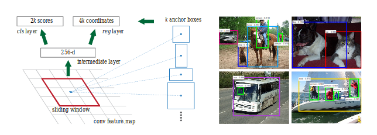

# We taught a robot how to eat apples.

Ok, we did not, it does not chew nor digest the apple.  But we taught it how to see one, reach for it and aovid obstacles in between.  Does that sound cool? Certainly. But, how did we do it?  How could it be useful? Well, stay with us to the end... 


## How we did it

Over the last couple of weeks our team the (dubbed the *Deterministically Suboptimal Cheesecakes*) had the chance to work with a Franka Emika Panda robotic arm. The general goal was to come up with a framework which would  allow the robotic arm to identify objects and other agents, distinguish them from background and itself as well as avoid obstacles during movement. Additionally we could implement a *brownie task* which would make use of the other features while performing an action such as cleaning up a table or handing objects to another agent. 

After some experimenting we settled for a an apple-centered approach: we would make the robot look for an apple, reach for it, pick it up and finally hand it to a human. All of this while constantly trying to not crash into any of the surrounding obstacles. We then further divided this main task into three subcomponents: object identification (*Seeing*), movement (*Reaching*) and obstacle avoidance (*Sensing*).  


#### Module 1  - Seeing

To be able to interact with the world the robot must have some sense of what this world consists of. This means it has to be able to identify objects and be able to know where they are. For this part of the task we could make use of the pandas rgb-d camera, but even with color and depth information image segmentation and object identification still poses a huge technical challenge, so the first step was to reduce and simplify: 

Prior goal is to find the locations of apples in a frame taken by the camera.

First of all we decided to not train an object detection network from scratch but make use of existing models, mainly the models from Tensorflow API model zoo. Secondly we decided to limit the scope of objects drastically. Instead of making use of all the categories defined on dataset which network is trained, we focused on only two: 'apples' and 'humans'. After the network returns classification results, we filter them by these two categories.

For giving an introduction to Tensorflow Object Detection API, there are several detection models provided by Tensorflow. Provided models have different architectures which are also trained on different datasets such as Kitti, CoCo and Open Image datasets etc. These models can be directly deployed in order to find objects in the range of datasets trained. 

#### CoCo Dataset

We chose the models trained on CoCo dataset for the purpose of detecting and locating apples on the scene. CoCo dataset is image dataset which has 90 categories spanning common objects such as apple, person, table, laptop etc. This dataset is used for segmentation, detection and captioning tasks.  Next to labels for images, it also provides annotations and masks for the location of objects as coordinates in image frames. So sequentially the networks trained on this dataset are trained on bounding boxes where the objects are located in the frame. 


Without retraining them, we tested SSD and Faster-RCNN models from Tensorflow model zoo. SSD models are more beneficial when latency is priority. They return object proposals with their bounding boxes within just 1 feed forward pass. In Faster-RCNN the region proposals are offered first and over region proposals classifications are done. It is slower in comparison to SDD however its accuracy is higher. You can see main differences between them in the image below:


With SSD architecture, we observed that object size plays a bigger role, it cannot locate small objects accurately. In Faster-RCNN object size does not play that big role, therefore in the end we decided to use Faster-RCNN architecture from Tensorflow API. For beginning, VGG19 architecture is investigated which has 13 shareable convolutional layers. Over the convolutional layers, another network for region proposal is used. Output of last conv layer is fed into network. The output of region proposal network is fed into 2 sibling fully connected layers. One of them returns the coordinates of possible bounding boxes as the other one returns the objectness score (object vs not object). After the last VGG19 convolutional layer, region proposal network and connection to fully connected layers are shown in the figure below with example cases from Ren, He et. Al [1]. 



The training is done in a way, for each region proposed by the network, a binary label is assigned. The intersection over union between ground truth box and proposed region is found, if it is greater than 0.7 it is assigned +1, else if it is less than 0.3 it is assigned -1. The values in between 0.7 and 0.3 are not taken into consideration. The classification loss is taken as log loss between two classes (object vs not object). Mini batch stochastic gradient descent is used for training.

For deploying the network, there are some configuration files provided which you can enter your details related to re-training and evaluation. It is deployed on Tensorflow and Python has been used for implementation. However we did not retrain it, after loading weights, feeding the interest frames into input tensor, bounding boxes, detected classes, classification scores are returned as output. You can find implementation under our source code *object_classification_toolbox.py / object_classifier.py*.  If you are interested in retraining [you can follow the post under page:](https://medium.com/@WuStangDan/step-by-step-tensorflow-object-detection-api-tutorial-part-1-selecting-a-model-a02b6aabe39e) .

The image below shows an example classification. Obviously the network finds and localizes the apple (in the upper left corner) with high confidence. It also gives us bounding  boxes for other objects such as a suitcase, a laptop and a book, but we can safely ignore such hallucinations. 


For one frame to be classified, average computation time on Nvidia GeForce 1080 GPU is 60 ms. 

Once the apple is identified and localized within a bounding box we can use the information from the depth camera to far we have to reach. 


For one frame to be classified, average computation time on Nvidia GeForce 1080 GPU is 60 ms. 


For returning real world coordinates, the center coordinates of bounding boxes in image frame are considered. Later on, by using focal length and principal point parameters from camera intrinsic parameters the image coordinates are carried upon camera coordinate system as:

X = (x - cx) / (fx\*scaling_factor) <br />
Y = (y - cy) / (fy\*scaling_factor) <br />

cx and cy = principal point coordinates in x and y axis <br />
fx and fy = focal length in x and y axis <br />

In Intel RealSense camera, focal length and principal point parameters are as: <br />

fx = 615.607<br />
fy = 615.607<br />

cx = 317.79<br />
cy = 239.907<br />

We calculate the coordinates in units of meter in the end. Later on by using rotation and translation of camera with respect to base of Franka panda robot, the real coordinates are transformed with respect to the base. 

#### Finding other Franka agents

Next goal of object detection is finding other Franka robots in the scene. For that, last layer of a pretrained network is decided to be retrained. For training Faster-RCNN it is necessary to bounding boxes of Franka images. Since it will be time consuming to annotate and there is not enough amount of clear images of Franka robot in the web, it was a better choice to retrain a network which was trained on image classification tasks. For that reason, Inception network trained on ImageNet is taken. For Franka classification, robotic arm images are gathered from the web. For Non-Franka classification, random images from PASCAL VOC2012 dataset are chosen. Data augmentation is applied by randomly scaling with coefficients between 0.5 and 1.5, randomly cropping by 20% offset from margins and adding gaussian noise. For both of the classes 150 images are gathered respectively, 70% of images are used for training, 30% is used for validation. Gradient descent by cross-entropy loss function is used in backpropagation. Training is repeated 4000 times. Currently, it discrimninates frontal images of Franka correctly, however when the background is white and there is no Franka in the scene, it is also giving false alarms, too. Therefore we think, probably since we did not have enough data, network might be over-fitting. Example cases of Franka images and non-Franka images used in training can be seen below:


#### Module 2  - Reaching 

Making a robot reach for a detected object might sound like a trivial problems. In robotics it is not. Helping 


```Markdown
$$ y = y(x,t) &= A e^{i\theta} $$


```

things we should mention: 

- general description of ProMP framework + reference to paper 
- advantages of ProMPs compared to derterministic trajectory 
- Combination with obstacle avoidance 
- mention that we only leared 3 promps

#### Module 3  - Sensing

Apart from the rgb-d camera the robot is aditionally equipped with  9 LIDAR sensors. LIDARs (short for 'light' and 'radar') use light pulses to sense the distance to the next nearest object. Here we use them for 'obstacle avoidance' or more generally 'anomaly detection' where an 'anomaly' is simply anything unusual or unexpected that enters the robots field of operation. 

To define what's unusual and what's not we sample many trajectories from the ProMP framework and let the robot move along them while recording its joint-angles and LIDAR measurements at each point in time. We then use this 'normal' data to train 9 identical feed forward networks such that each of them learns to associate a given joint configuration with an expected signal to one of the LIDARs. 


Once the networks have learned what sensory signals to expect in given position, we can compare these predictions to the actual measurements and use the deviation of the measurement from the prediction as indication that an anomaly has entered the scene. A little more specifically what we do is, we sample a timeseries of roughly 10 LIDAR measurements $$M$$ and joint-angel configurations over the course of 0.1s. We then calculate the predictions $$P$$ from the joint angles and calculate the deviation via: 


$$
\overline{err} = median\left((P-M)\odot W\right)
$$
where $W$ is a matrix which weighs the errors based on the initial prediction (because a misprediction in an area  out of the robots reach should be feared less than one that might lead to a collision). Not using the absolute difference between $P$ and $M$ ensures that the robot only worries about things which are closer than expected (because only those pose any danger in  this setting). And finally taking the median over a number of samples balances out some of the measurement- noise. 

Finally one could justifiably ask why we used this specific approach for predicting lidar measurements. Apart from the presented method we also experimented with LSTMs, Autoencoders and several types of feed forward networks. We settled for the current strategy simply because in the limited timeframe it turned out to be the only one we got to work. 


## Adding the Parts together


## Wait, but what for?

The non-technical reader might be most impressed by our approach and achievements. But, he or she may wonder, why was it worth the effort? Is this another brick towards a Terminator machine programmed to kill Sarah Connor? 

We think the opposite. We believe a robot that can interact with its environment might be very well used as a device that helps humans. Think about it: picture a robot arm in the house of a person with disabilities, either motor impairments or an elderly adult.  If this arm is in the capacity of interacting with the environment, detecting objects of the daily living and interacting with them, it would be well suited to become a personal helper of the individual, thus helping them gain a certain degree of independance. 

This vision on assistive robotics is, of course, not new. But our belief is that  an holistic approach (i.e., a system in which machine learning, computer vision, classical robotics, human-robot interfaces and control theory are present and interact) is the way to go.  We hope that our progress with this Franka robot, who we nicknamed Sarah Connor*, helps laying a brick towards _that_ nicer future. 

[1] Shaoqing Ren, Kaiming He, Ross B. Girschick, Jian Sun: Faster R-CNN: Towards Real-Time Object Detection with Region Proposal Networks. IEEE Trans. Pattern Anal. Mach. Intell. 39(6): 1137-1149 (2017)

/* No pun intended.


